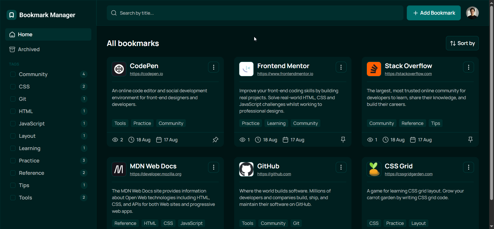
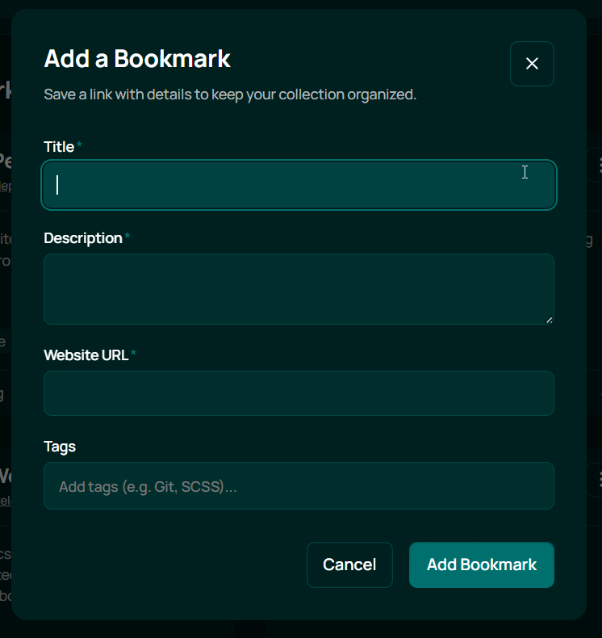
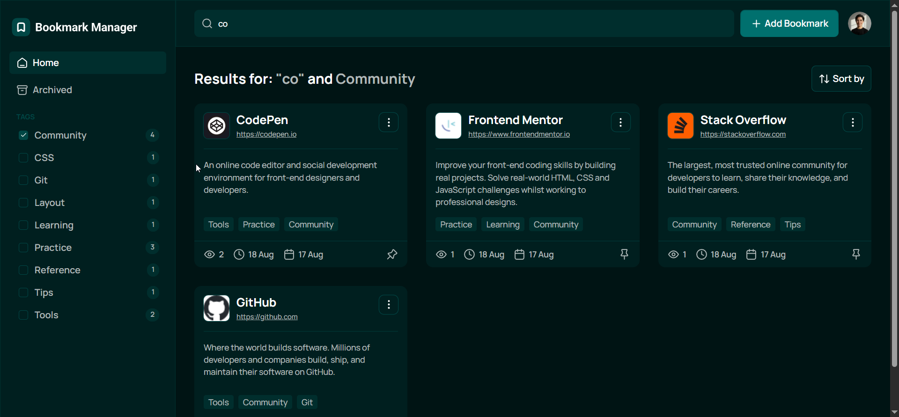
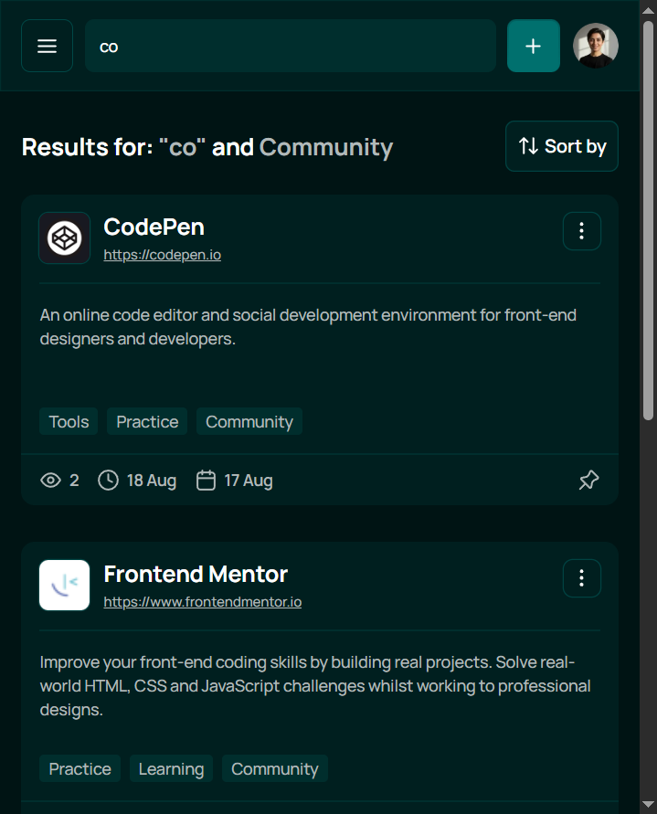

# Bookmark manager - Frontend Client

Клиентская часть приложения для организации, категоризации и быстрого поиска закладок. Построена на React, TypeScript и
Redux Toolkit.

[](https://react.dev/)
[](https://www.typescriptlang.org/)
[](https://redux-toolkit.js.org/)
[](https://vitejs.dev/)

---

## Скриншоты интерфейса

|          Главная панель с закладками           |                Модальное окно добавления                |
| :--------------------------------------------: | :-----------------------------------------------------: |
|  |  |

|      Фильтрация по категориям и тегам      |          Темная тема / Мобильный вид          |
| :----------------------------------------: | :-------------------------------------------: |
|  |  |

---

## Связанные репозитории и демо

- **Backend API:** [Ссылка на backend репозиторий](https://github.com/Krealf/bookmark-manager-be)
- **Live Demo:** []()

---

## Стек технологий

- **Фреймворк/Библиотека:** React v19.2
- **Язык:** TypeScript v6.0
- **Сборщик:** Vite v8.1
- **Стейт-менеджмент:** Redux Toolkit (RTK Query / Redux Thunk)
- **Стилизация:** CSS Modules
- **Маршрутизация:** React Router v8.3
- **HTTP-клиент:** Axios v1.19

---

## Особенности интерфейса

- Адаптивный дизайн для мобильных устройств, планшетов и десктопов.
- Управление состоянием аутентификации с автоматическим обновлением access токена.
- Быстрый клиентский поиск. .
- Сортировка по дате добавления, частоте переходов и алфавиту.

---

## Быстрый старт

### Требования

- Node.js >= 20.x
- npm / yarn / pnpm

### Установка и запуск

1. Клонируйте репозиторий:

```bash
git clone https://github.com/Krealf/bookmark-manager-fe.git
cd bookmark-manager-fe
```

2. Установите зависимости:

```bash
npm install
```

3. Настройте файл переменных окружения:

```bash
cp .env.example .env
```

Отредактируйте `.env`::

```env
VITE_API_PORT=3000
VITE_API_URL="/api"
```

4. Запустите сервер в режиме разработки:

```bash
npm run dev
```

Приложение будет доступно по адресу `http://localhost:3000`.
